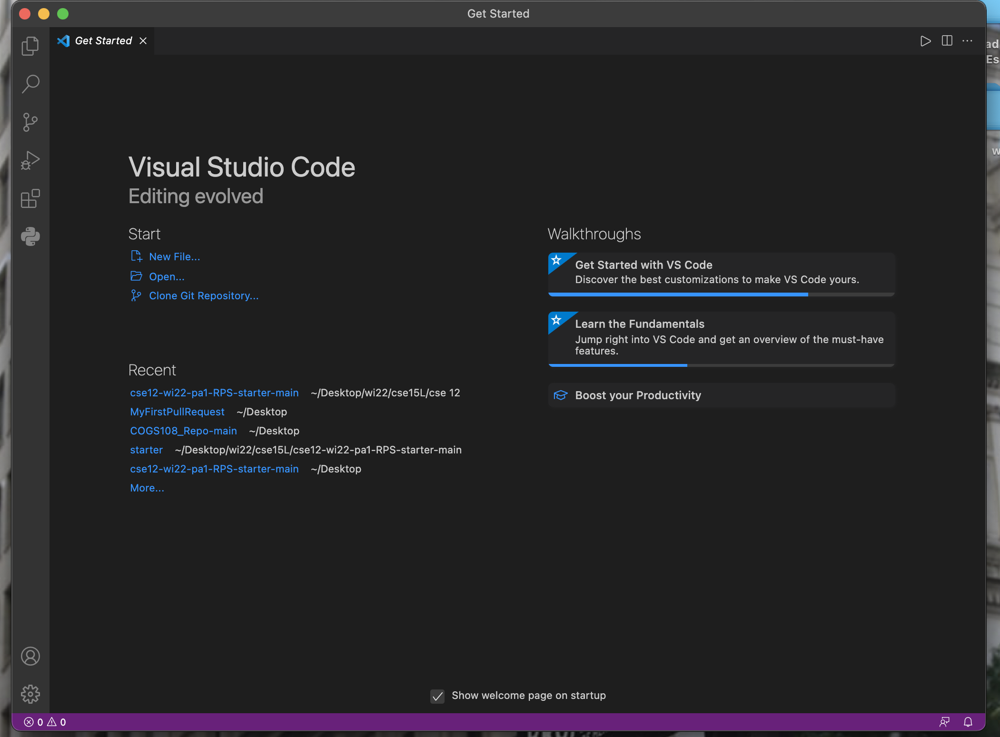
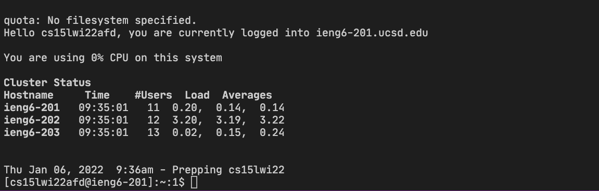
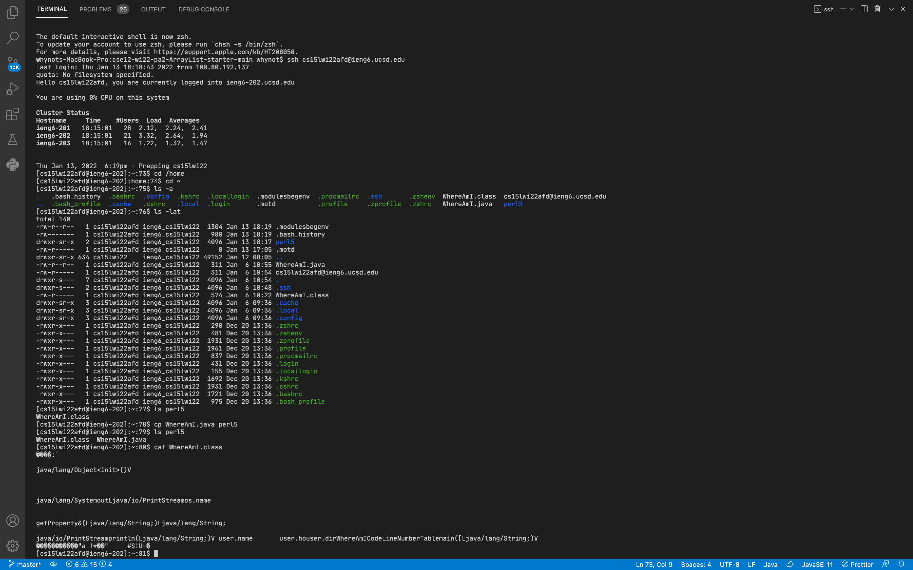
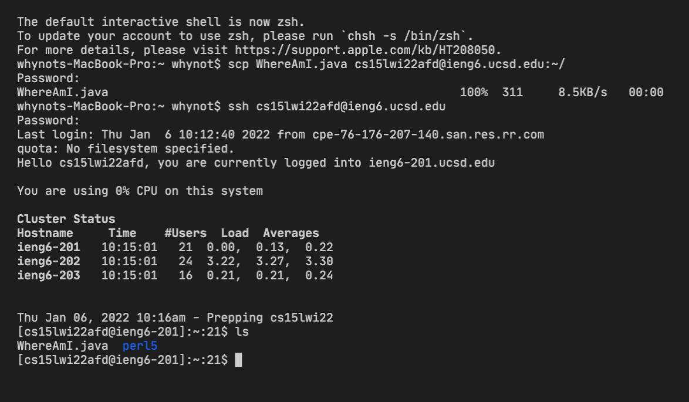
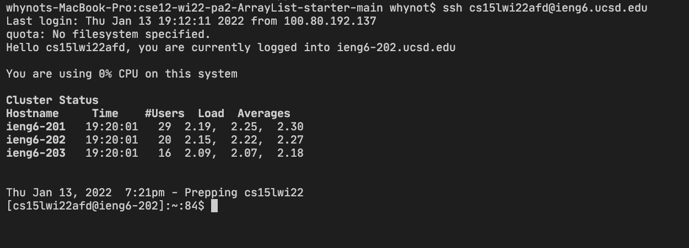
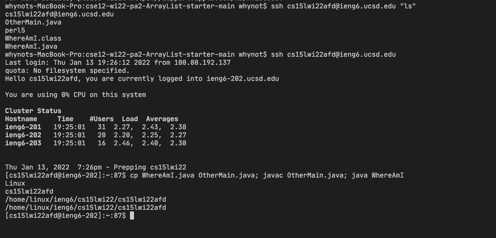

# Week 2 lab Report

- In this lab you’ll set your computer up for remote access to your own **ieng6** account and practice with commands that work with the filesystem.

> Let's get started

---

> ## Part 1 - Installing VS code

- First intall visual code by going to the VS code website [https://code.visualstudio.com/](https://code.visualstudio.com/)

- Choose the correct operating system version and intall , like OSX (for Macs) and Windows (for PCs)

- When it is installed, you should be able to open a window that looks like this

- 

---

> ## Part 2 - Remote Connecting

- If you are on Windows: install a program called OpenSSH, which is a program that can connect your computer to other computers that have this kind of account: \
  [Install OpenSSH](https://docs.microsoft.com/en-us/windows-server/administration/openssh/openssh_install_firstuse)

- Then look up your course specific account for CSE15L here
  [https://sdacs.ucsd.edu/~icc/index.php](https://sdacs.ucsd.edu/~icc/index.php)

- Then, in Visual Studio Code, we are going to connect to the remote computer using VSCode’s remote option.

  1. For the first step, open a terminal in VSCode. Your command will look like this, but with the zz replaced by the letters in your course-specific account.
     The code should be something look like this \
     ` $ ssh cs15lwi22zz@ieng6.ucsd.edu`\
      \
      Since it likely the first time you’ve connected to this server, you will probably get a message like this:

     ```
     ⤇ ssh cs15lwi22zz@ieng6.ucsd.edu
     The authenticity of host 'ieng6.ucsd.edu (128.54.70.227)' can't be established. RSA key fingerprint is SHA256:ksruYwhnYH+sySHnHAtLUHngrPEyZTDl/1x99wUQcec. Are you sure you want to continue connecting (yes/no/[fingerprint])?

     ```

     It is normal Since we are connecting to the server for the first time

     So type `yes` and press enter, then give your password; the whole interaction should look something like this once you give your password and are logged in

     You should get something look like this:

     

     Now your terminal is connected to a **computer in the CSE basement**, and any commands you run will run on that computer!

---

> ## Part 3 - Trying some command

- Try to run some commands `cd`, `ls`, `pwd`, `mkdir`, and `cp`

- `cd`
  \
   Use to naviagte between directories

- `cd ~`
  \
   Put the user into the home directory

- `ls -lat`
  \
  show a list of all files sorted by date

- `ls -a`
  \
  show all files including hidden files

- `ls <directory>`
  \
  list on its own lists all files in the **current directory** except for hidden files.

- `cp`
  \
  copy files or group of files or directory

- `cat`
  \
   It reads data from the file and gives their content as output.

  ***

  Feel free to try to run the command by yourself, Here I will show you an example of what you will get:

  

> Note:
> To log out of the remote server in your terminal, you can use:\
> Ctrl-D \
> Run \
> the command exit

---

> ## Part 4 - Moving files over SSH with `scp`

- Another way to copy a file (or many files!) from your computer to a remote computer. The command is called `scp`, and we will always run it from the client (that means from your computer, not logged into ieng6). Create a file on your computer called WhereAmI.java and put the following contents into it:

  ```
  class WhereAmI {
  public static void main(String[] args) {
    System.out.println(System.getProperty("os.name"));
    System.out.println(System.getProperty("user.name"));
    System.out.println(System.getProperty("user.home"));
    System.out.println(System.getProperty("user.dir"));
    }
  }
  ```

  If we run the file on your computer, we should see our own usernmae.

  Then, in the terminal from the directory where we made this file, run this command:

  `scp WhereAmI.java cs15lwi22zz@ieng6.ucsd.edu:~/`

  You should be prompted for a password just like when you log in with `ssh`

  Then, log into ieng6 with ssh again, and use `ls`. You should see the file there in your home directory!

  Here is what you will expected to get after running the code:
  

> ## Part 5 - Setting an SSH Keys

- Every time we log in or run scp, we have to type (or copy-paste) our password. It is very time-consuming
- So to tackle this problem, we have SSH keys
- After creating keys, the ssh command can use the pair of files in place of your password. This is a common setup step in lots of work environments that involve code on a server.

> Lets create the SSH Keys

1. Run the setup

   ```
   whynots-MacBook-Pro:~ whynot$ ssh-keygen
   Generating public/private rsa key pair.
   Enter file in which to save the key (/Users/whynot/.ssh/id_rsa):
   Enter passphrase (empty for no passphrase):
   Enter same passphrase again:
   Your identification has been saved in /Users/whynot/.ssh/id_rsa.
   Your public key has been saved in /Users/whynot/.ssh/id_rsa.pub.
   The key fingerprint is:
   SHA256:/0mp8A52rSQ93lkSMT6Cno6l16h9hcVd6GahfoopIfc whynot@whynots-MacBook-Pro.local
   The key's randomart image is:
   +---[RSA 3072]----+
   |               . |
   |              o .|
   |           .o+ o |
   |         . .+o=  |
   |        S .++o   |
   |      ..o+.oo+.  |
   |       oO=*+=o.  |
   |       B+OEB.=   |
   |      +oo+* =    |
   +----[SHA256]-----+
   ```

   If you’re on Windows, follow the extra `ssh-add` steps here: \
   [https://docs.microsoft.com/en-us/windows-server/administration/openssh/openssh_keymanagement#user-key-generation](https://docs.microsoft.com/en-us/windows-server/administration/openssh/openssh_keymanagement#user-key-generation)

   This created two new files on your system; the private key (in a file id_rsa) and the public key (in a file id_rsa.pub), stored in the .ssh directory on your computer.

   Now we need to copy the public (not the private) key to the .ssh directory of your user account on the server.

   ```
   $ ssh cs15lwi22zz@ieng6.ucsd.edu
   <Enter Password>
   # now on server
   $ mkdir .ssh
   $ <logout>
   # back on client
   $ scp /Users/Whynot/.ssh/id_rsa.pub cs15lwi22afd@ieng6.ucsd.edu:~/.ssh/authorized_keys
   # You use your username and the path you saw in the command above
   ```

   **Once you do this, you should be able to ssh or scp from this client to the server without entering your password.**

   Here is a demonstration of what you should get after setting the ssh keys
   

---

> ## Part 6 - Optimizing Remote Running

- You can write a command in quotes at the end of an ssh command to directly run it on the remote server, then exit.

  `$ ssh cs15lwi22@ieng6.ucsd.edu "ls"`

- You can use semicolons to run multiple commands on the same line in most terminals. For example, try:\
  `$ cp WhereAmI.java OtherMain.java; javac OtherMain.java; java WhereAmI`

  Expected output:
  

> Note \
> We can see that by using the semicolumn in-line, we are able to run the command even more-pleasent

---

That is the end of the week 2 lab report\
**Thank You very much for reading ^v^**
