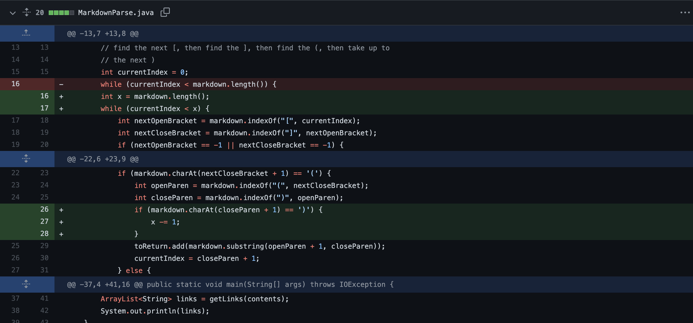

# Week 4 lab Report

- In this lab I am going to go over the debugging process for code that prints all valid links in a markdown file.

> Let's get started

---

> ## First Change
>
> **_Fix an infinite cause by file ending with [] but without a link after it_**

- In this case, the bug was a failure to handle the case of file ending with [] but without a link after it.

- When I try to run the [failure-inducing input](https://github.com/whybruhh/markdown-parse/blob/main/break-file.md?plain=1), the output is:
  

- The symptom of the failure-inducing input is that my program go through an infinite loop. The program looped enough to fill the stacks memory, so giving us a `OutOfMemoryError`.

- The bug here is because of closeParen doesn't exists when the program call the `indexof()` method. It always return -1. Hence it update the currentIndex to be 0 again. So, it start the loop again, causing an **_infinite loop_** bug.

- I add a line of code `markdown.charAt(nextCloseBracket + 1) == '('` to check if there is close parentheses after close bracket. It break the while loop if the condition don't match.

- Here I fix the code
  

- It fixed the first bug successfully!
  

---

> ## Second Change
>
> **_Fix an infinite loop cause by dobule double parentheses_**

- In this case, the bug was a failure to handle the case of file with double parentheses.

- When I try to run the [failure-inducing input](https://github.com/whybruhh/markdown-parse/blob/main/break-file2.md?plain=1), the output is:
  

- The symptom of the failure-inducing input is that my program go through an infinite loop. The program looped enough to fill the stacks memory, so giving us a `OutOfMemoryError`.

- I can't figure out the reason why it give an infinite loop at first

- So I do the following check:

  1. Checking the index of closeParentheses
  2. checking Markdown length
     

- The result is 75,40,75,73

- I notice that the bug here is because of the index of **second** close parentheses is two smaller than the `markdown.length()` . Which mean current index is always one smaller than `markdown.length()`.

- So, it start the loop again and again, causing an **_infinite loop_** bug.

- Here I fix the code
  
- I add a line of code
  `if (markdown.charAt(closeParen + 1) == ')') { x -= 1; }`
  to check if there is two close parentheses near each other.

- If there exists two close parentheses near each other, the program is going to decrease the markdown length by 1 in order to prevent the infinite loop

- It fixed the Second bug successfully!
  

---

> ## Third Change
>
> **_Fix prinitng out an invalid link_**

- In this case, the bug was a failure to handle the case of prinitng out an invlaid link

- When I try to run the [failure-inducing input](https://github.com/whybruhh/markdown-parse/blob/main/break-file4.md?plain=1), the output is:
  

- The symptom of the failure-inducing input is that my program return an invlid link.

- In this case, it is only some words, but not a link inside the parentheses . So, it shouldn't be return.

- I notice that the bug here is because of not checking whether there is an actual link inside parentheses.

- I add a line of code\
  `if (markdown.substring(openParen + 1, closeParen).contains(".com") || markdown.substring(openParen + 1, closeParen).contains(".html")) } `

  to check if it there is a valid link inside the parentheses

- Here I fix the code
  

- If either one of the condition above is true, the program would add the valid link to the **toReturn** list, else it would break the loop and don't return anything

- It fixed the third bug successfully!
  

---

That is the end of the week 4 lab report\
**Thank You very much for reading ^v^**
