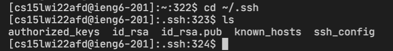
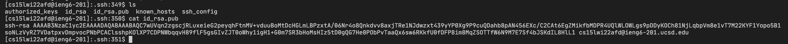
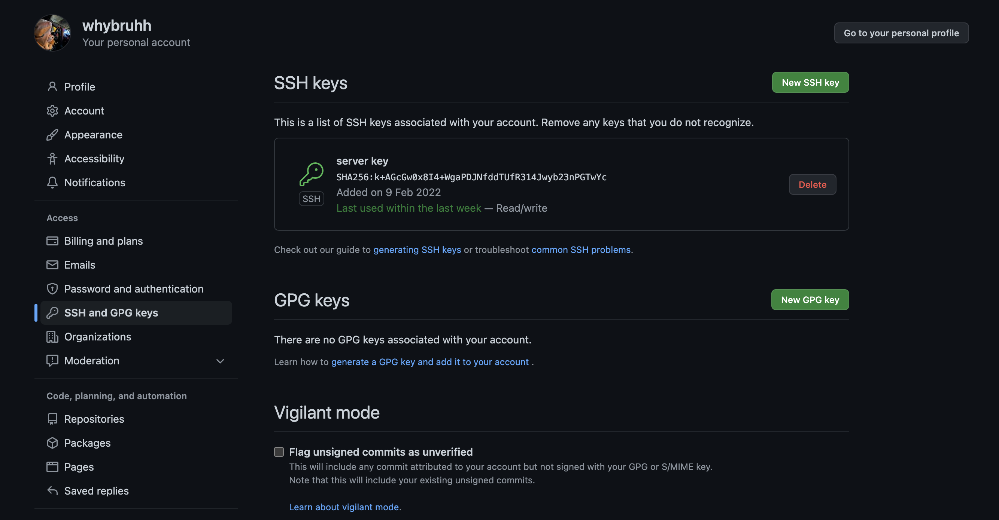
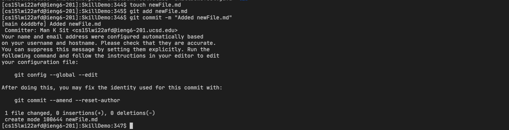
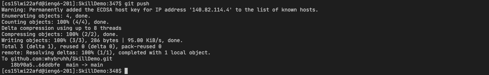
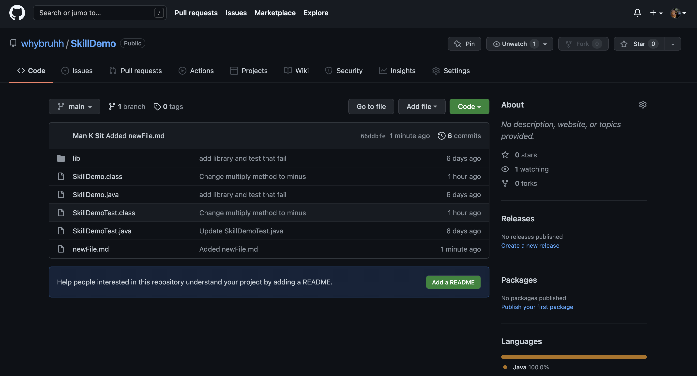

# Week 6 lab Report

- In this lab I am going to go over setting github access from ieng6

> Let's get started

---

> ## Setting up

1. From your remote server, create a new ssh key by using the `ssh-keygen` command from [Lab 1](https://whybruhh.github.io/cse15l-lab-reports/lab-report-1-week-2.html)

   - The new public and private ssh keys can be found in ssh
     

2. Open the public key file by using the command `cat id_rsa.pub`. This will print out the public key and we are able to copy it.
   

3. Open github account, then go to setting -> SSH and GPG keys

4. Press the New SSH Key button Then copy all the public key to github.
   

5. we have to make sure our git is using SSH instead of HTTPS protocol [reference](https://docs.github.com/en/get-started/getting-started-with-git/managing-remote-repositories)

   

6. We are able to using git with ssh keys

---

> ## Access github

1. First we'll create a new file in our repo called newFile.md by using the `touch` command. Then we can add it by using `git add` newFile.md and `git commit -m `"commit message"
   

2. Then we will push our local commit to the remote orgin using git push. Note that we can do this now since we have already set up our ssh key.
   

3. When we go to github now, we are able to see that there is a [change](https://github.com/whybruhh/SkillDemo/commit/66ddbfe1ba28bb128b593c49cadb2f62dd370e2d)

   
