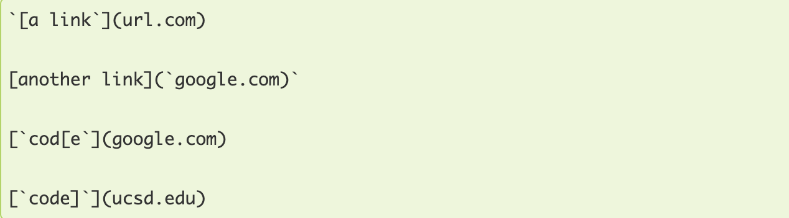
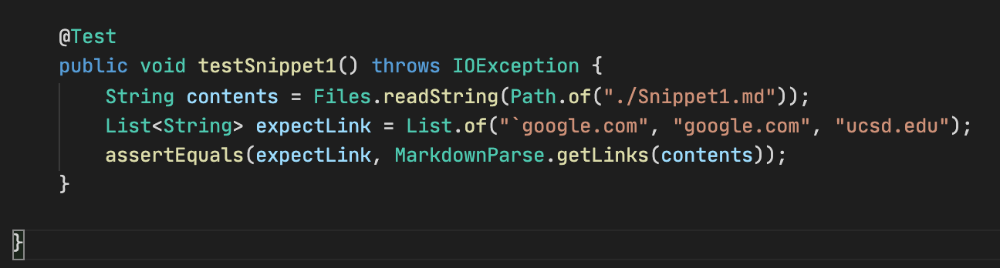

# Week 8 lab Report

- In this lab, I am going to review three snippet and then I am going add test cases for both my implementation of markdown-parse, and the implementation I reviewed.

---

## MarkdownParse and Testing Procedure

- The programs being tested are called MarkdownParse.java. I created a file call MarkdownParseTest.java which include JUnit tests and going to run them here using command shown below:

  ```
  javac -cp .:lib/junit-4.13.2.jar:lib/hamcrest-core-1.3.jar MarkdownParseTest.java

  java -cp .:lib/junit-4.13.2.jar:lib/hamcrest-core-1.3.jar org.junit.runner.JUnitCore MarkdownParseTest
  ```

- Below are the github links for the two MarkdownParse programs we are testing

  (1). [My MarkdownParse](https://github.com/whybruhh/markdown-parse)

  (2). [Joe's MarkdownParse](https://github.com/ucsd-cse15l-w22/markdown-parse)

---

## Markdown Snippet 1

> Here we go over testing how programs handle snippet 1 shown below



1. Using the preview slide of visual studio code, we can determine that our MarkdownParse programs should return a list of ["google.com", "google.com", "ucsd.edu"]

2. We can now write a JUnit test to compare the values returned by Markdownparse to our expeced values:
   

3. Running the Junit using our, I get the following output when testing MarkdownParse on snippet 1:
   > My MarkdownParse


- This implementaiton fails on snippet 1. We can see this in the java.lang.AssertionError, meaning the returned value was different than the expected. It retuned url.com when it shouldn't have.

- There is not a small code change that will allow the program to handle this edge case. Conceptually, you would need to have the program ignore all instances of inline code using barticks (ie take them out of the text considered when the program is running). However, since there are also edge cases in creating inline code (ex in snippet 1 si where the parentheses cuts it off in the second link) you would need to write a large amount of code to figure out what to exclude.
