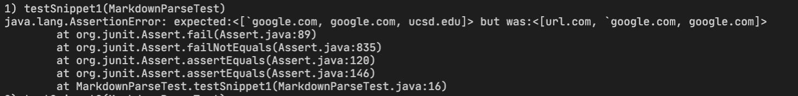
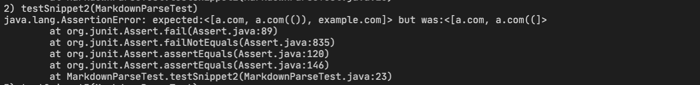
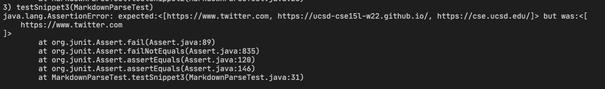

# Week 8 lab Report

- In this lab, I am going to review three snippet and then I am going add test cases for both my implementation of markdown-parse, and the implementation I reviewed.

---

## MarkdownParse and Testing Procedure

- The programs being tested are called MarkdownParse.java. I created a file call MarkdownParseTest.java which include JUnit tests and going to run them here using command shown below:

  ```
  javac -cp .:lib/junit-4.13.2.jar:lib/hamcrest-core-1.3.jar MarkdownParseTest.java

  java -cp .:lib/junit-4.13.2.jar:lib/hamcrest-core-1.3.jar org.junit.runner.JUnitCore MarkdownParseTest
  ```

- Below are the github links for the two MarkdownParse programs we are testing

  (1). [My MarkdownParse](https://github.com/whybruhh/markdown-parse)

  (2). [Joe's MarkdownParse](https://github.com/ucsd-cse15l-w22/markdown-parse)

---

## Markdown Snippet 1

> Here we go over testing how programs handle snippet 1 shown below


1. Using the preview slide of visual studio code, we can determine that our MarkdownParse programs should return a list of ["google.com", "google.com", "ucsd.edu"]

2. We can now write a JUnit test to compare the values returned by Markdownparse to our expeced values:
   

3. Running the Junit using our, I get the following output when testing MarkdownParse on snippet 1:

   > Joe's MarkdownParse

   

   - This implementaiton fails on snippet 1. We can see this in the java.lang.AssertionError, meaning the returned value was different than the expected. It retuned url.com when it shouldn't have.

   > My MarkdownParse

   

   - This implementaiton fails on snippet 1. We can see this in the java.lang.AssertionError, meaning the returned value was different than the expected. The program returned `url.com` which it shouldn't have and failed to return `ucsd.edu`.

   - There is a big code change that will allow the program to handle this edge case. We need the program ignore all instances of inline code using barticks (i.e. take them out of the text considered when the program is running). However, since there are also cases in creating inline code (for example in snippet 1 `` [`cod[e`](google.com) ``, after removing the barticks, we still get a linke name`[e]`) we would need to write a large amount of code to figure out what to exclude.

---

## Markdown Snippet 2

> Here we go over testing how programs handle snippet 2 shown below


1. Using the preview slide of visual studio code, we can determine that our MarkdownParse programs should return a list of ["a.com", "a.com((", "example.com"]

2. We can now write a JUnit test to compare the values returned by Markdownparse to our expeced values:
   

3. Running the Junit using our, I get the following output when testing MarkdownParse on snippet 1:

   > Joe's MarkdownParse

   

   - This implementaiton passes on snippet 2.

   > My MarkdownParse

   

   - This implementaiton fails on snippet 2. We can see this in the java.lang.AssertionError, meaning the returned value was different than the expected. It retuned `a.com((` instead of `a.com` and fail to return `example.com`

   - There is a relatively small code addition that could be added to handle this case. We only have to add code for finding new square brackets and parentheses to check for nesting.

   - A nested link has a characteristic of two open breackets or two open parentheses. We only have to check if there are same amount of brackets or parentheses there. If the number are same, meaning the link is nested. (for example in 2nd case a.com(()), there are two open parenthese, but at the same time, it has two close parenthese, hence we are sure that it is nested)

---

## Markdown Snippet 3

> Here we go over testing how programs handle snippet 3 shown below


1. Using the preview slide of visual studio code, we can determine that our MarkdownParse programs should return a list of ["https://www.twitter.com", "https://ucsd-cse15l-w22.github.io/", "https://cse.ucsd.edu/"]

2. We can now write a JUnit test to compare the values returned by Markdownparse to our expeced values:
   

3. Running the Junit using our, I get the following output when testing MarkdownParse on snippet 1:

   > Joe's MarkdownParse

   

   - This implementaiton fails on snippet 3. We can see this in the java.lang.StringIndexOutOfBoundsException, meaning the code is not working

   > My MarkdownParse

   

   - This implementaiton fails on snippet 2. We can see this in the java.lang.AssertionError, meaning the returned value was different than the expected. It fail to return `"https://ucsd-cse15l-w22.github.io/" and "https://cse.ucsd.edu/"`. Also we notice that there is a lot of space of the returned link

   - There is a small code change that would allow the program to handle newlines nested in brackets and parentheses. Since newlines do not affect whether a link exists in md files, we want our code to ignore them. We can accomplish this by using the string function removeAll() to get rid of the newlines before running our program on the text.
